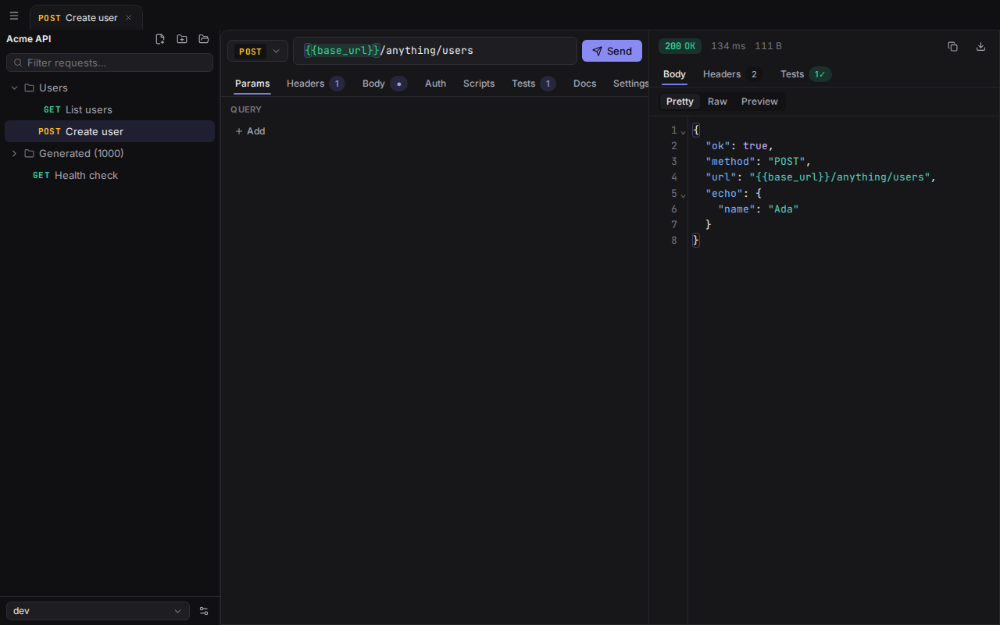

# 友 Tomo

> A friendly, TOML-native API client. Lightweight, offline, git-first.



**Tomo** is a minimalist desktop API client built with Tauri 2 + Rust. Your
collections are plain folders of readable, hand-editable [TOML files](docs/format.md) —
no accounts, no cloud, no proprietary database. The name is a triple pun:
**TOM(L)** (the file format), *tomo* = a volume/book in Portuguese (a collection
is a tome of requests), and 友 *tomo* = "friend" in Japanese.

## Why

| | Tomo | Electron-based clients |
|---|---|---|
| Installer | ~10–15 MB | ~200 MB |
| Idle RAM | low (native webview) | high (bundled Chromium) |
| HTTP | native Rust (reqwest) | in-Chromium, CORS quirks |
| Storage | plain TOML, git-friendly | proprietary / cloud |

## Features

- **Requests** — every HTTP method, query/path params, headers, and bodies:
  JSON, text, XML, form-urlencoded, multipart (with streamed file parts),
  binary, GraphQL.
- **Auth** — none/inherit, basic, bearer, API key, digest, OAuth2
  (client-credentials & password, with token caching).
- **Variables** — six scopes with clear precedence, `{{var}}` with dot/index
  paths, dynamic `{{$uuid}}`/`{{$timestamp}}` values, and git-ignored secrets.
- **Scripting & tests** — pre/post-request JavaScript (`req`/`res`/`vars`/
  `console`), a jest-style `expect()`/`test()` API, and declarative asserts.
- **Beautiful UI** — light/dark/system themes, JetBrains Mono, a virtualized
  tree that stays smooth at 1000+ requests, a command palette (`Ctrl+K`), and
  live `{{variable}}` highlighting with resolved-value tooltips.
- **Filesystem-first** — external edits (git pull, your editor) sync live;
  saves are surgical and preserve your comments and ordering.
- **Bilingual** — English and Portuguese (BR), following your system locale.

## Development

```sh
# System prerequisites (Linux — Tauri needs webkit2gtk)
sudo apt install -y libwebkit2gtk-4.1-dev build-essential curl wget file \
  libxdo-dev libssl-dev libayatana-appindicator3-dev librsvg2-dev

pnpm install
pnpm tauri dev            # the desktop app
pnpm dev                  # frontend only (browser, mocked backend)

# quality gates
./scripts/check.sh        # cargo fmt + clippy + test (Rust core)
pnpm test                 # Vitest unit tests
pnpm exec playwright test # end-to-end (browser + mock transport)
pnpm build                # typecheck + production frontend build
```

The Rust core (`crates/core`) is pure logic with no Tauri dependency and a
large test suite; the Tauri app (`src-tauri`) is a thin command/event layer.
The frontend runs entirely in a plain browser against an in-memory mock, so most
of the UI is developed and tested without launching the desktop shell.

## Architecture

```
crates/core/   tomo-core — TOML format, variables, HTTP engine, scripting, watcher
src-tauri/     Tauri 2 shell — thin #[command] layer + event bridge
src/           React 19 + TypeScript + Tailwind v4 + Zustand + CodeMirror 6
docs/format.md the TOML format spec
```

## License

[MIT](LICENSE) © Daniel Freitas
